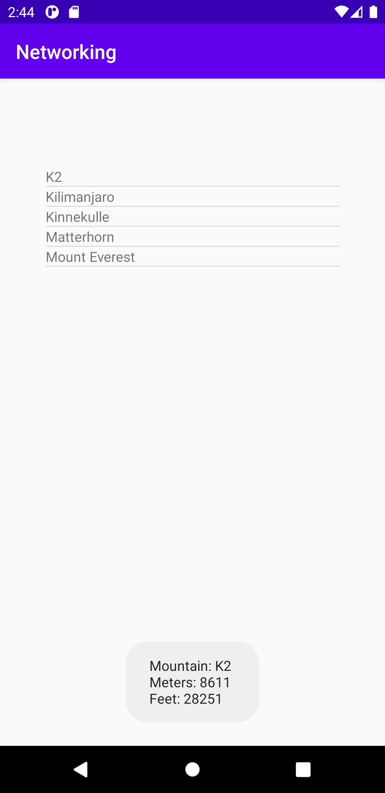

# Rapport

```xml
    <ListView
           android:id="@+id/list_view"
           android:layout_width="300dp"
           android:layout_height="wrap_content"
           app:layout_constraintBottom_toBottomOf="parent"
           app:layout_constraintLeft_toLeftOf="parent"
           app:layout_constraintRight_toRightOf="parent"
           app:layout_constraintTop_toTopOf="parent">
       </ListView>
```
Lade till en listView i activity_main.xml som tilldelades ett id och "layout attribut".  


```java
    private ArrayList<Mountain> listData;
    private ArrayAdapter<Mountain> adapter;
```
Deklarerade två privata medlems variabler, en ArrayList och en ArrayAdapter som båda är
av typen Mountain.


```java
    listData = new ArrayList<>(); 

    adapter = new ArrayAdapter<>(this, R.layout.list_item_textview, listData); 

    ListView my_listView=(ListView) findViewById(R.id.list_view);
    my_listView.setAdapter(adapter);
```
Variabeln listData tilldelades en Arraylista och adaptern tilldelades en Array adapter som 
tog list_item_textview (layout fil för textview för items) och listData som parameter. 
En variabel "my_listView" skapades av typen Listview och tilldelades den listView som skapades
i activity_main.xml med dess ID. 
Adaptern applicerades därefter på my_listView för att kunna processera rå data till list items.  


```java
public class Mountain {
    private String ID;
    private String name;
    private String type;
    private String company;
    private String location;
    private String category;
    private int size;
    private int cost;
    private Auxdata auxdata;
```
Därefter skapades en ny klass för datatypen Mountain. I klassen skapades dess state med privata 
medlems variabler för de egenskaperna som berget har.  


````java
  <uses-permission android:name="android.permission.INTERNET" />
````
Gav appen internet åtkomst i manifestet för att kunna hämta data från webservicen. 


```java
@SuppressLint("StaticFieldLeak")
    private class JsonTask extends AsyncTask<String, String, String> {

        private HttpURLConnection connection = null;
        private BufferedReader reader = null;

        protected String doInBackground(String... params) {

    //Har inte med hela koden för AsyncTask...
```
Lade till AsyncTask klassen som bla består av metoderna doInBackground() och onPostExecute().
Denna kod lades till så inte appens interface går trögt pga att data ska hämtas från nätet
(då appen körs som en enda tråd). Då kan denna klass förhindra att sådana tillstånd förekommer genom
att istället köra en ny tråd (task) när data från nätet ska hämtas, parallelt med den ursprungliga 
tråden. 


````java
new JsonTask().execute("https://wwwlab.iit.his.se/brom/kurser/mobilprog/dbservice/admin/getdataasjson.php?type=brom");
````
I OnCreate "invokas" AsyncTask med new JsonTask().execute("URL"), där data från webservicen hämtas. 


````java
     @Override
            protected void onPostExecute(String json) {
                Log.d("TAG ==>", json);
                Gson gson = new Gson();
                Mountain[] temporary = gson.fromJson(json,Mountain[].class);
    
                for (int i = 0; i < temporary.length; i++) {
                    Mountain mountain = temporary[i];
                    Log.d("AsyncTask ==>", "Found a mountain!: "+mountain);
                    listData.add(mountain);
    
                }
                adapter.notifyDataSetChanged();
            }
    

````
I onPostExecute initieras ett nytt Gson objekt. Därefter tolkas json data från webservicen som java
objekt med gson.fromJson och mountain klassen. Java objekten läggs i en temporär array "Mountain[]"
och loopas igenom med en for loop där för varje iteration så läggs varje mountain objekt som ett item
i listan "listData".    

Därefter meddelas adaptern om att innehållet i Arraylisten "listData" har uppdaterats. 


````java
  @Override
     public String toString() {
         return name;
     }
 
     public String getToastMsg() {
         return "Mountain: "+name+"\nMeters: "+size+"\nFeet: "+cost;
     }
````
Metoden toString() används för att få ut data om bergets namn i listview.  
Metoden getToastMsg() lades till i Mountain klassen för att kunna hämta olika egenskaper hos ett
berg. 


````java
 my_listView.setOnItemClickListener(new AdapterView.OnItemClickListener() {
             @Override
             public void onItemClick(AdapterView<?> parent, View view, int position, long id) {
                 Toast.makeText(getApplicationContext(),listData.get(position).getToastMsg(), Toast.LENGTH_SHORT).show();
             }
````
För my_listview anges en setOnItemClickListener för att utföra något när man klickar på ett specifikt
item i my_listview. I detta fall anropas metoden "getToastMsg()" som skapades i förgående kodsnutt.
Om man då klickar på ett item så undersöks positionen i listData för vilket item man klickat på.
Därefter körs metoden getToastMsg() som i ett toast meddelande skriver ut data om det berg man klickat på.    


## Screenshot på färdig applikation



**Bild på listView med berg och toast vy med data för berget K2**